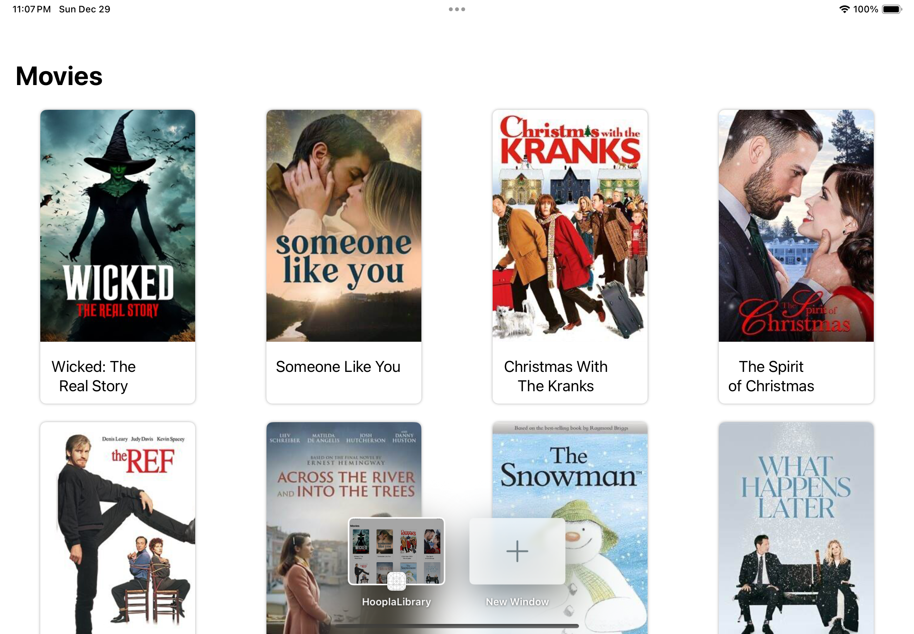
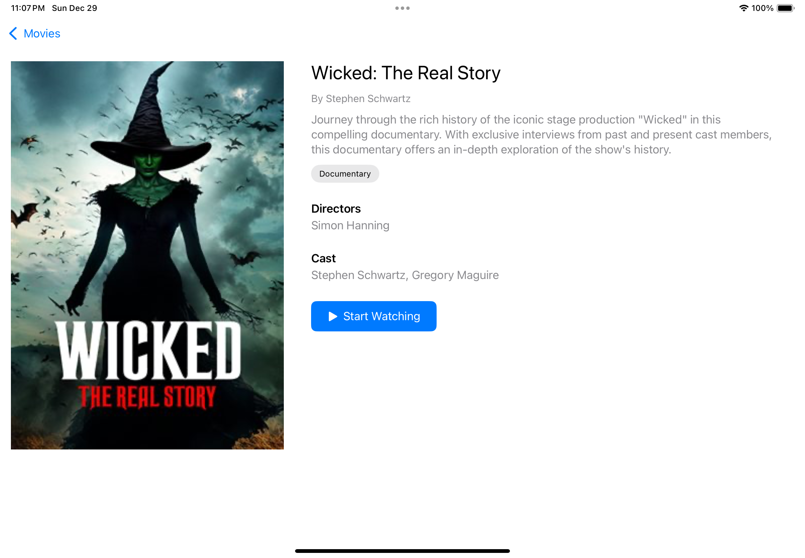
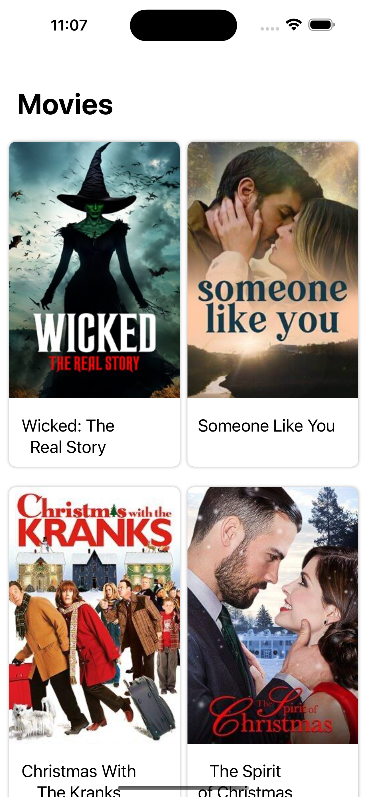
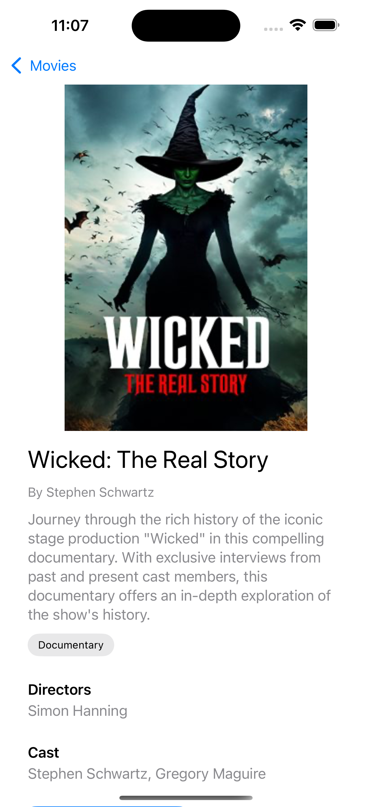

# Hoopla Library App

A SwiftUI app that demonstrates modern iOS development practices by integrating with Hoopla's GraphQL API to browse and view movie details.

## Screenshots

| iPad Grid | iPad Detail |
|-----------|-------------|
|  |  |

| iPhone Grid | iPhone Detail |
|-------------|---------------|
|  |  |

## Features

- Browse popular movies in a responsive grid layout (adapts to iPhone/iPad)
- Infinite scrolling with pagination
- Detailed movie view showing:
  - Movie poster
  - Title and artist
  - Synopsis
  - Genres
  - Directors and cast
- Clean architecture using:
  - MVVM pattern
  - Protocol-based services
  - Generic network layer
  - GraphQL integration
  - Combine for async operations

## Technical Details

- **Minimum iOS Version**: iOS 15.0
- **Architecture**: MVVM
- **Frameworks**:
  - SwiftUI
  - Combine
  - Foundation
- **Network**: Custom network layer with GraphQL support
- **Testing**: Protocol-based services for mockability
